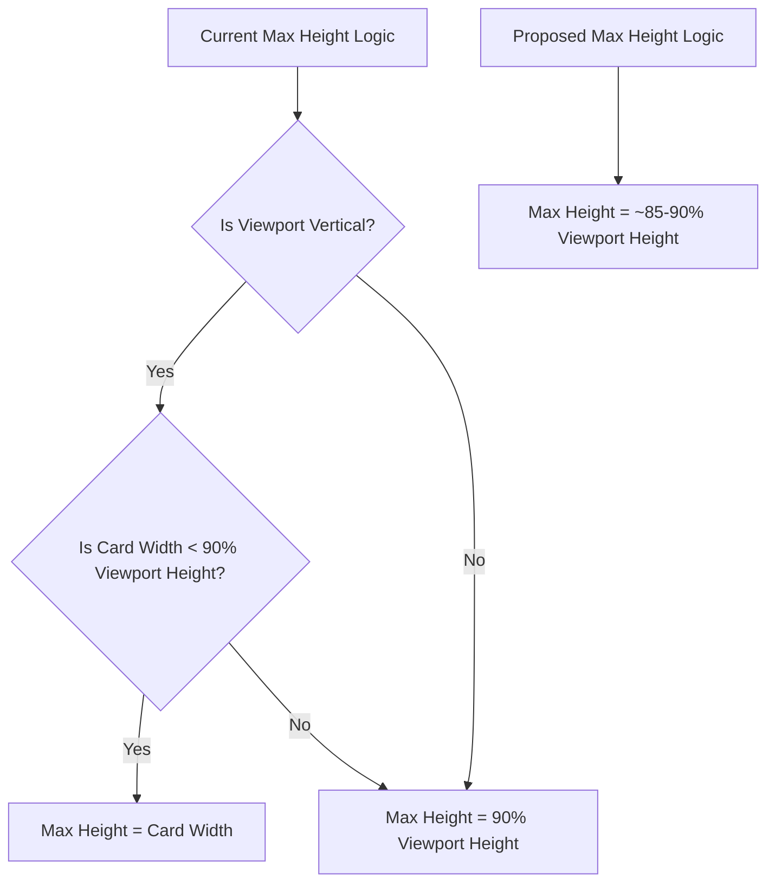

# Plan to Fix FocusedIdeaView Layout on Vertical Screens

## Problem

The `FocusedIdeaView` component, which displays a single idea card, uses a layout calculation (`cardMaxHeight = Math.min(cardWidth, viewportHeight * 0.9)`) that limits the card's height based on its width. On vertical screens (like phones in portrait mode), the limited width becomes the primary constraint, resulting in a card that is too short, potentially cutting off content and not effectively using the available vertical space.

The goal is to make the card layout more responsive on vertical screens, allowing it to take up more height while preserving the "sticky note" aesthetic (rounded corners, border, etc.) and ensuring content is scrollable when it exceeds the screen height.

## Proposed Solution

Modify the logic for calculating the card's maximum height to prioritize utilizing the available vertical space on vertical screens, while still maintaining a reasonable size on wider screens and preserving the sticky note appearance.

## Detailed Plan

1.  **Modify the `calculateMaxHeight` function in `idea/src/FocusedIdeaView.tsx`:**
    *   Change the logic to set the `maxHeight` based primarily on a percentage of the viewport height (e.g., 85% or 90%). This will allow the card to be taller on vertical screens.
    *   Remove the current constraint that limits the height based on the card's width (`cardWidth`). The existing `maxWidth` property (`maxWidth: 'calc(42rem * 1.5)'`) already helps control the width on larger screens.
2.  **Update the `style` prop:** Ensure the calculated `maxHeight` is correctly applied to the `cardRef` element's style property within the main card container div.
3.  **Verify Sticky Note Aesthetics:** Confirm that the existing Tailwind CSS classes (`rounded-xl`, `border-2`, `border-border-grey`) and the background/shadow styling continue to provide the desired sticky note appearance after the height calculation change.
4.  **Test Responsiveness:** After implementation, test the component on different screen sizes and orientations (especially phone portrait) to ensure it behaves as expected, allowing scrolling when content overflows.

## Visual Representation of the Change

This updated logic will allow the card to scale its height more effectively on vertical displays, providing a better user experience by making more content visible without excessive scrolling initially, while still allowing scrolling for lengthy content. The existing styling will preserve the desired visual aesthetic.