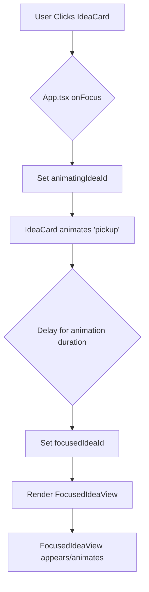

# Plan for Idea Card Pickup Animation

## Objective
Implement a "pickup" animation for the IdeaCard when it's clicked, making it move towards the center before the FocusedIdeaView appears.

## Current Animation Flow
1. User clicks on an `IdeaCard`.
2. `onFocus` in `App.tsx` is called, setting `focusedIdeaId` to the clicked card's ID.
3. This causes the clicked `IdeaCard` to become `isHidden` (invisible).
4. It also causes `FocusedIdeaView` to render with the focused idea, triggering its slide-in animation.

## Proposed Animation Flow (Pickup Animation)

## Detailed Plan

1.  **Modify `IdeaCard.tsx`:**
    *   Remove the `isHidden` prop usage in the `className`.
    *   Add a new prop, e.g., `isPickingUp: boolean`.
    *   Use the `isPickingUp` prop to apply a CSS class that defines the animation (e.g., using `@keyframes` or CSS transitions for `transform` and `opacity`). The animation should move the card from its current position to the center of the viewport and potentially fade it out slightly or scale it down/up slightly as it moves.

2.  **Modify `App.tsx`:**
    *   Add a new state variable, e.g., `animatingIdeaId: Id<"ideas"> | null`, initialized to `null`.
    *   Modify the `onFocus` handler:
        *   Set `animatingIdeaId` to the clicked `idea._id`.
        *   After a delay that matches the "pickup" animation duration, set `focusedIdeaId` to the clicked `idea._id` and reset `animatingIdeaId` to `null`. This will trigger the rendering of `FocusedIdeaView` after the `IdeaCard` animation.
    *   Pass the `isPickingUp` prop to `IdeaCard`, setting it to `idea._id === animatingIdeaId`.
    *   Modify the conditional rendering of `FocusedIdeaView` to only render if `focusedIdea` is true AND `animatingIdeaId` is null.

3.  **Modify `FocusedIdeaView.tsx`:**
    *   Review the existing animation logic (lines 167-173) and the `isAnimatingIn` state. Determine if this animation is still necessary or if it should be modified/removed since the `IdeaCard` will now handle the movement. It might be best to keep a subtle fade-in or scale effect for the `FocusedIdeaView` itself.